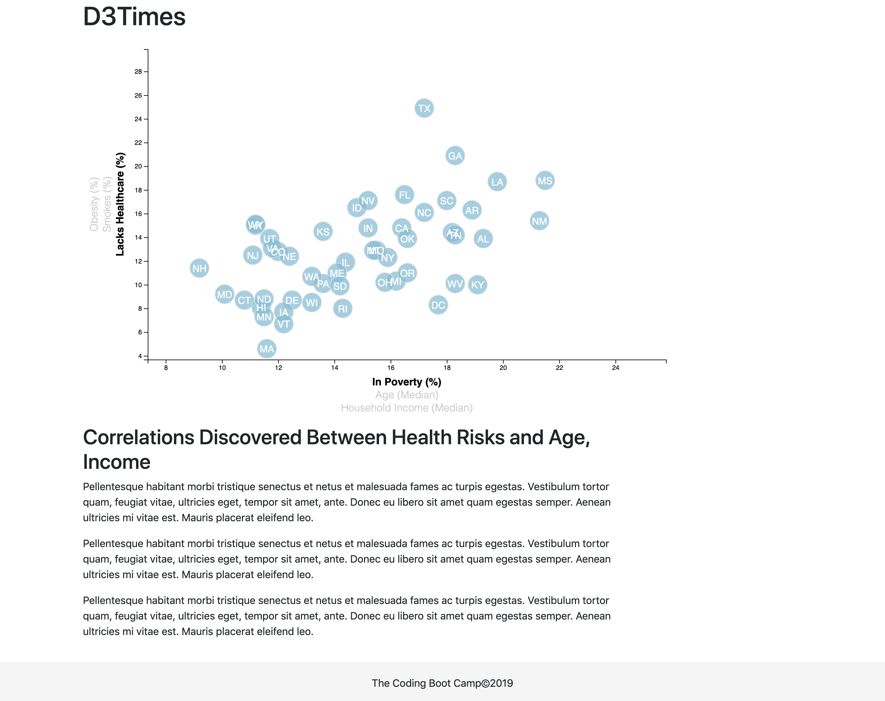

# Assignment 16: Data Journalism and D3 - SooBin
This exercise utilizes D3.js to plot the 2014 U.S. census data that shows various relationships among different health risk factors (`assets/data/data.csv`). The plot is placed in a setting that resembles a newspaper section.

For codes, please refer to the following documents:
* `assets/js/app.js` for main javascript visualization
* `assets/css/d3Style.css`
* `assets/css/Style.css`
* `index.html`

You can access the web dashboard by clicking [here](https://soobing91.github.io/Assignment_16_SooBin/index.html).

When running on a local environment, please make sure that `python3 -m http.server` is enabled.

The screenshot below captures the web app:

